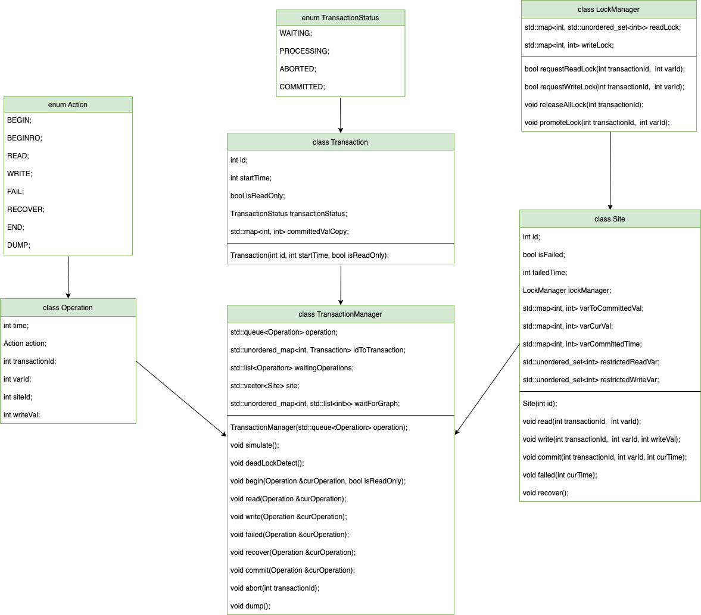

# Documentation and Code Structure - RepCRec
A term project for Advanced Database System (CSCI-GA.2434-001) in New York University, Fall 2022

## Team Members
- Che-Hsien Chiu (cc7293@nyu.edu)
- Pin-Tsung Huang (pth254@nyu.edu)

## Programming Language
C++

## Design Graph

## Algorithm
- Use **strict two-phase locking** (with read and write locks) to implement the **available copies** approach.
- Locks are acquired in a **FIFS** (first-come-first-serve) fashion.
- Detect deadlocks by **depth-first search cycle detection**.
- Choose and abort **the youngest transaction** in the cycle.
- Use **multi-version read consistency** for read-only transactions.
- Avoid **write starvation**.

## Major Module
- Transaction Manager
  * `simulate()`, `deadLockDetect()`, `dump()`
  * `begin()`, `abort()`
  * `read()`, `write()`, `commit()`
  * `failed()`, `recover()`

- Lock Manager
  * Manage read locks and write locks of each sites.
  * `requestLock()`, `releaseLock()`, `releaseAllLocks()`, `promoteLock()`.

- Site
  * Manage replicated variables and non-replicated varivable of the sites.
  * `read()`, `write()`, `commit()`
  * `failed(cur_Time)`, `recover()`

## Testing Scripts

